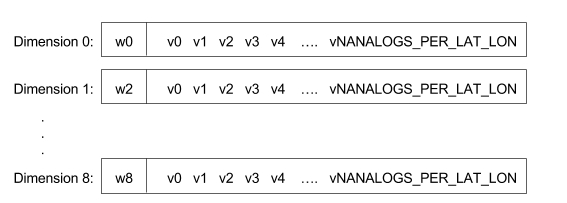

# Albero Forecasts


Albero is a Visual analytics solution for the visualization and analysis of probabilistic weather forecasts based on the RAR technique. Albero targets at least two different types of users: meteorologists who work in operational weather forecasting (forecasters) and meteorologists who are researchers working on numerical weather prediction (researchers). 
Albero provides with an efficient tool for analyzing precipitation forecasts, allowing forecasters to make and communicate decisions.


## Development Details

This document will explain some of the internal details of the implementation. 

The algorithm implemented by Albero has three well defined parts: Read Historic Forecast, Calculate Analogs, and Calculate Probabilistic Forecast.

### Read Historic Forecast 

#### ReadHistoricForecast()

Invokes the reading of the historical refororecasts and current forecast. We’ll call current forecast to the forecast for which the probabilistic forecast will be generated. The reforecast files contain precipitation accumulation data sorted by Latitude, Longitude, Time (date) and Hour. 
It is stored in the NetCDF file as follows:


```
NTIME x NFHOUR x NLAT x NLON
```


The current forecast is read from a NetCDF file as well, and since it corresponds to a given particular date, it is stored temporarily as follows


```
NHOUR x NLAT x NLON
```


The algorithm requires historical forecasts solely for dates around the current forecast date, for past years, so a 90 days window surrounding the current date will be taken from the historical data, for each available year.


```
NYEARS x NTIMEWINDOW (90 days) x NFHOUR x NLAT x NLON
```


After the current and historical reforecasts are read, the accumulation ranges must be computed. For instance, if the user wishes to visualize a 24 hours probabilistic forecast accumulated by 12 hours, then two accumulation ranges will be computed (this is simply done by adding hourly precipitations).


After computing the historical accumulation ranges for the required temporal windows, the historical data is stored, for each range, as follows:


```
NYEARS x NTIME_WINDOW x NLAT x NLON
```


These structures only store data, there is no description about the actual year, day, latitude or longitude.

The ForecastReader has arrays to describe the data.

```
forecast_days[NTIME]
lats[NLAT]
lons[NLON]
```

fhour has no descriptor, since we know it is every 6 hours.

As a summary, there are two structures used on the next step of the method:

```
historical_forecast_by_range[NRANGE] : NYEARS x NTIME_WINDOW x NLAT x NLON
current_forecast_by_range[NRANGE]: NLAT x NLON
```

### Calculate Analogs
#### CalculateAnalogs()

The idea is to find which past forecasts are most similar to the forecast on a given date (current forecast), for all accumulation ranges.
For each accumulation range, we will find analogs for each region of 1° x 1°. Even when we are looking for analogs for a  1° x 1° region, we will consider the surrounding  3°x 3° area.


The analogs are computed finding those historical forecasts with lower mean square error (MSE) on the 16 points of the of the grid. 
The analogs are stored per accumulation range, latitude and longitude, associated with the top left point of the center region (the red point).


```
analogs: NLAT x NLON x NRANGES x N_ANALOGS_PER_LAT_LON
```

### Calculate Probabilistic Forecasts

#### CalculateProbabilisticForecast()

The process is quite simple. We need a probabilistic forecast for each accumulation group and threshold selected by the user. Each 1° x 1° region will be sampled in 5 x 5 points (OBSERVATIONS_PER_PANEL). For each sampled point, we’ll look at the precipitation observed on the dates on the 3° x 3° are of the containing 1° x 1° region. Based on weather or not the precipitation observed for each point surpasses the threshold, a probability will be calculated.

For each 1° x 1° region we will calculate the probabilistic forecast for the 3° x 3° surrounding area, using the analogs associated with the top left point of said region. This means that, for each point, we will count with 9 different probabilities. Since analogs for adjacent regions can be quite different, all 9 probabilities are combined according to the distance to the center of the corresponding 1° x 1° region for which analogs were used in the calculation.

We will say each point has 9 dimensions, since it has 9 sets of observations. One dimension per set of observations.

The fact that a point can have multiple observations can be easily understand with the following image taken from Hamill and Withaker paper.


We will calculate the probability for probability_map_height x probability_map_width points, defined as:


```
probability_map_height = ((NLAT - 1) * (OBSERVATIONS_PER_PANEL-1)) + 1;
probability_map_width = ((NLON - 1) * (OBSERVATIONS_PER_PANEL-1)) + 1;
```

We will start the process by defining an array of observations for each point, this is, N_ANALOGS_PER_LAT_LON + 1 analogs for each of the 9 dimensions. This array is called probability_points (it should probably be renamed to point_dimension_observations).
We are adding +1 since in addition to the observations, we will store the distance to the center of the dimension region for smoothing purposes. (It will make sense soon, I promise)

The algorithm starts by iterating each 1° x 1° region from the left bottom of the grid.


(Remember, the analogs for the 3° x 3° region are stored associated to the black dot)

For each one degree region, the first step is to calculate the center of the region (the blue dot). Then, the observations for the analogs for the surrounding 3° x 3° area are retrieved and stored in region_observations.

The next step is to iterate the small points inside the surrounding area, and store their observations on the probability_points array for the corresponding dimension.


For each point, the dimension will be calculated as shown on the following image:


As the first element of the observation array for a given point and dimension, the distance between the point and the center of the region (the blue dot on the previous image) is stored. Note that values on the dimension 4 (which is the one associated to the analogs we used to retrieve the observations) will have the shortest distance to the center (if we we weren’t implementing a smoothing algorithm, only this dimension would have been used).

This process is repeated for each latitude and longitude on the available area.

The result of this process is 9 sets of observations and distances (one per set) for each point of the probability_point structure.

Now we can proceed to finally calculate the actual probability map. Remember, the user selected r ranges of accumulation and t thresholds, so we will generate t*r probability maps, and each of them will have as many points as the probability_points structure.

For every point on each of the probability maps, it is necessary to combine the observations of each dimension, in order to smooth the resulting forecast, using the distance previously calculated.

Each point has associated: 


Where d is the distance to the center of the region.

The next step is to convert each distance to a non normalized weight, using the following formula:


Where x is [0...8] and D is the biggest distance found.

After all non normalized weight are calculated, the weights are normalized, so that the weight sums 1.


```
w_i =  w'_i / ( w'_0 + w'_1 + w'_2 + w'_3 + w'_4 + w'_5 + w'_6 + w'_7 + w'_8)
```

After normalizing the weights, we then have, for each point:



So now, for each accumulation range r and threshold t, we take each point and calculate the probability as follows:


Where pi(t)is the probability of finding an observation v higher than t, which is:

```
(100  NAnalogsPerLatLon)* amountOfObservationsAvobeThreshold 
```
Getting this way the probability for each point, combining all 9 dimensions.


